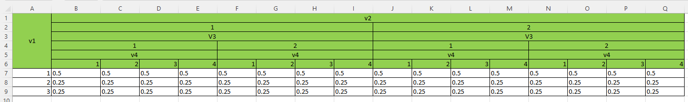

# Multi-header-data

## ABSTRACT
Given a data table with multiple variables (V1, V2,...,Vn), you can choose one question and one or multiple headers, and the code generates an Excel table counting each case.

## STRUCTURE OF INPUT DATA
In the next picture we can see the generan structure of an input data table. Each row represents a particular case of study, with its particular ID and different value for each variable (V1, V2,.., Vn).

## HOW IT RUNS
The user must pick one variable as a question, and one or multiple variables as headers. The purpose of this code is get the frequency of each different answer, for each combination of the answers of the headers. 

## OUTPUT

This Software returns a 2-sheets Excel document. One sheet with a normalizate table and the other with a non- normalizate table, like this:

Hint: (In this pictures, frequencies are not well calculated)

